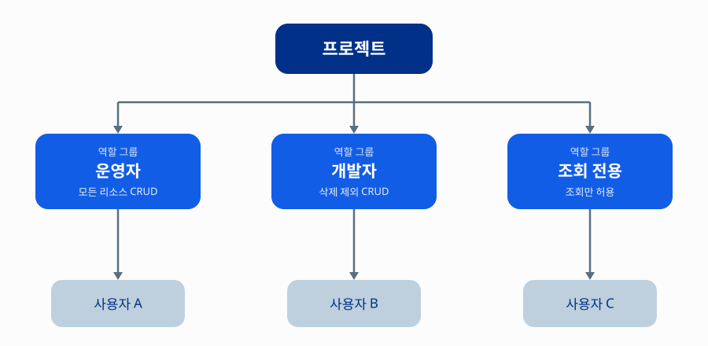

# IAM으로 멀티 사용자 권한 분리 구성하기

이 가이드를 따라하면 하나의 프로젝트를 여러 명이 함께 사용할 때, IAM(Identity and Access Management)으로 구성원별 역할을 나누어 각자 필요한 만큼만 권한을 부여할 수 있습니다.

여러 팀원(운영자, 개발자, 조회 전용 사용자 등)이 하나의 NHN Cloud 프로젝트를 공동으로 사용하는 조직을 가정합니다. 지금까지 마스터 계정을 공유하거나 모든 구성원에게 같은 권한을 부여해 왔다면, 이 가이드에서 역할별로 권한을 나누어 서로의 업무 범위를 침범하지 않도록 구성하는 방법을 다룹니다.

## 시작하기 전에

- 프로젝트 또는 조직에 대한 관리자 권한이 있어야 합니다. 역할 그룹을 만들고 멤버에게 연결하는 작업은 관리자만 수행할 수 있습니다. 구체적으로는 역할 그룹 생성에 `Project.RoleGroup.Create`(조직 공통 역할 그룹은 `Organization.Project.RoleGroup.Create`), 멤버 추가에 `Project.Member.Create` 권한이 필요합니다.
- 분리하려는 역할별 업무 범위가 미리 정의되어 있어야 합니다. 예를 들어 인프라 운영, 개발, 조회 전용처럼 역할을 나눕니다.
- 권한을 부여할 대상 멤버의 계정 정보(이메일 등)를 준비합니다. NHN Cloud는 조직 내에서만 유효한 IAM 계정과, 조직이 삭제되어도 유지되는 일반 NHN Cloud 계정을 함께 지원합니다. 두 계정은 **멤버 관리** 탭 안에서 **NHN Cloud 계정**과 **IAM 계정** 서브탭으로 구분되어 있으니, 대상 멤버가 어느 쪽에 해당하는지 미리 확인하세요.
- 프로젝트를 **IAM 계정**으로 생성한 경우, 그 프로젝트에는 **NHN Cloud 계정을 직접 추가할 수 없고 IAM 계정만 추가할 수 있습니다.** NHN Cloud 계정을 멤버로 추가해야 한다면 고객센터를 통한 별도 처리가 필요하므로, 역할 그룹을 설계하기 전에 프로젝트를 누가 생성했는지 먼저 확인하세요.
- 프로젝트를 생성한 사용자는 생성과 동시에 그 프로젝트의 `ADMIN` 권한을 자동으로 부여받으며, 이 권한은 역할 그룹처럼 연결을 해제할 수 있는 대상이 아닙니다. 따라서 프로젝트 생성자 본인 계정으로는 "권한이 전혀 없는 상태"를 재현할 수 없으므로, 권한이 제한된 멤버의 동작을 확인하려면 생성자가 아닌 별도 계정을 멤버로 추가해서 테스트해야 합니다.

## 역할별 권한 분리 구성하기

역할 그룹(role group)은 관리자가 멤버 또는 멤버 그룹에 지정하는 권한의 모음입니다. 역할 그룹을 구성할 때는 서비스나 프로젝트 관리 기능 단위로 미리 정의된 권한 묶음인 역할(role)을 선택하거나, 개별 권한을 직접 조합합니다. 역할 그룹을 세분화할수록 각 멤버는 자신의 업무에 꼭 필요한 권한만 갖게 되어, 실수나 악의적인 접근으로 인한 피해 범위를 최소화할 수 있습니다. 이런 방식을 RBAC(role-based access control, 역할 기반 접근 제어)라고 하며, 조직의 업무 기능에 따라 역할 그룹을 만들고 역할 수행에 필요한 최소한의 자원에만 접근하도록 제한하는 것이 핵심입니다.

업무 역할을 정의하기 전에 다음과 같이 역할별 업무 범위를 먼저 정리합니다. 이렇게 정리한 역할 하나하나가 실제로는 콘솔에서 **역할 그룹**이라는 단위로 만들어집니다.

| 역할 | 업무 범위 예시 |
|---|---|
| 운영자 | 프로젝트 내 모든 리소스의 조회, 생성, 수정, 삭제 |
| 개발자 | 개발에 필요한 리소스의 조회, 생성, 수정(삭제 권한은 제외) |
| 조회 전용 | 모든 리소스의 조회만 허용 |

역할 이름과 범위는 조직의 실제 업무 구조에 맞게 바꿔서 사용하세요. 프로젝트 하나에 여러 역할 그룹을 만들고, 각 역할 그룹에 해당하는 멤버를 연결하면 다음과 같은 구조가 됩니다.

### 콘솔에서 설정하기

1. NHN Cloud 콘솔에서 프로젝트 상단 탭 중 **역할 그룹 관리**를 클릭합니다.

    IAM 관련 기능은 좌측 내비게이션의 서비스 카테고리가 아니라, 프로젝트 대시보드와 같은 레벨의 상단 탭(**멤버 관리**, **역할 그룹 관리** 등)에 있습니다.

2. **역할 그룹 추가**를 클릭하고, 앞서 정의한 역할(운영자, 개발자, 조회 전용) 단위로 역할 그룹을 하나씩 만듭니다.

    - **역할 그룹 이름**: `운영자`, `개발자`, `조회전용`처럼 구분되는 이름을 입력합니다.
    - **설명**: 해당 역할 그룹의 업무 범위를 간단히 적습니다.

3. **역할 선택** 영역에서 권한을 매핑합니다.

    왼쪽 트리에서 권한을 부여할 서비스를 선택하면, 가운데 패널에 **역할** 탭과 **권한** 탭이 나타납니다.

    - **역할** 탭에는 서비스별로 미리 정의된 역할이 있습니다. 예를 들어 Object Storage라면 전체 권한을 가진 `Object Storage ADMIN`부터 조회만 가능한 `Object Storage Object VIEWER`까지 여러 역할이 준비되어 있어, 업무 범위 표와 가까운 역할을 그대로 선택하면 됩니다.
    - 서비스 하나하나가 아니라 **프로젝트 전체**를 대상으로 업무 범위를 나누고 싶다면, 왼쪽 트리 맨 위의 `ProjectRole` 카테고리에서 프로젝트 단위 프리셋을 선택할 수 있습니다. `ADMIN`은 프로젝트 내 모든 서비스에 대한 전체 권한, `MEMBER`는 대부분의 서비스에 대한 조회·생성·수정 권한(삭제는 서비스에 따라 제외될 수 있음), `VIEWER`는 모든 서비스에 대한 조회 권한만 부여합니다. 업무 범위 표의 운영자·개발자·조회 전용 역할과 거의 그대로 대응되므로, 먼저 이 프리셋으로 시작한 뒤 부족한 부분만 다듬는 방법도 있습니다.
    - 사전 정의된 역할만으로 원하는 권한 범위를 만들 수 없다면 **권한** 탭에서 개별 권한을 추가로 선택할 수 있습니다. 역할과 권한은 함께 선택할 수 있습니다.

    예를 들어 조회 전용 역할 그룹은 `ProjectRole`의 `VIEWER`를 선택하거나 각 서비스의 VIEWER 계열 역할만 선택하고, 개발자 역할 그룹처럼 조회·생성·수정은 허용하되 삭제는 제외하고 싶다면, `MEMBER` 프리셋을 선택한 뒤 그래도 삭제 권한이 포함된 서비스가 있다면 **권한** 탭에서 조회·생성·수정에 해당하는 개별 권한만 선택하는 방식으로 다듬습니다.

    선택을 마쳤다면 **추가**를 클릭해 역할 그룹을 생성합니다.

4. 역할 그룹 목록에서 방금 만든 역할 그룹을 클릭해 상세 화면으로 들어갑니다.

    상세 화면에는 **NHN Cloud 계정**, **IAM 계정**, **역할** 탭이 있습니다. 멤버 쪽이 아니라 역할 그룹 쪽에서 계정을 연결하는 구조라는 점에 유의하세요.

5. **NHN Cloud 계정** 또는 **IAM 계정** 탭에서, 이 역할 그룹에 연결할 대상 멤버를 추가합니다. 조직 외부 인원은 NHN Cloud 계정 탭에서, 조직 전용 인원은 IAM 계정 탭에서 추가합니다.

    한 멤버를 여러 역할 그룹에 동시에 연결할 수도 있는데, 이 경우 각 역할 그룹의 권한이 합쳐져 적용되므로 최소 권한 원칙을 지키려면 그 멤버의 실제 업무에 꼭 필요한 역할 그룹만 연결합니다.
    <!-- 🔍 검증 필요: 한 멤버를 여러 역할 그룹에 연결했을 때 권한이 합산되는 방식(담당자 문의 필요 — 테스트 계정이 프로젝트 소유자여서 콘솔 재현으로는 검증 불가) -->

> **💡 알아두기**
> IAM 콘솔의 접속 URL은 `https://{조직 도메인}.console.nhncloud.com` 형식으로, 조직마다 다르게 발급됩니다. IAM 계정은 이 URL로 접속해 조직 OWNER가 지정한 ID로 로그인합니다. 멤버를 초대할 때 조직 전용 URL을 함께 안내하세요.

## 동작 확인하기

역할 그룹별 권한이 의도한 대로 적용되었는지 확인합니다.

1. 역할 그룹을 연결한 멤버 계정으로 로그인합니다.
2. 해당 역할 그룹에 포함되지 않은 서비스나 권한(예: 조회 전용 역할 그룹으로 리소스 삭제 시도)에 접근했을 때 차단되는지 확인합니다.
   <!-- 🔍 검증 필요: 권한 부족 시 노출되는 오류 메시지 또는 상태 코드(담당자 문의 필요 — 프로젝트 소유자 계정으로는 권한 제한 상태 재현 불가) -->
3. 반대로 역할 그룹에 포함된 권한 범위 안에서는 정상적으로 조회·생성 등의 작업을 수행할 수 있는지 확인합니다.

의도한 범위보다 권한이 넓거나 좁게 적용되어 있다면, 역할 그룹의 권한 매핑을 다시 검토합니다.

## 응용하기

- **적용 범위 조정**: 역할 그룹은 기본적으로 **프로젝트 단위로 완전히 독립적**입니다. 한 프로젝트에서 만든 역할 그룹은 같은 조직의 다른 프로젝트에 자동으로 나타나거나 공유되지 않으므로, 프로젝트마다 역할 그룹을 각각 구성해야 합니다. 또한 조직의 Owner라고 해서 자동으로 모든 프로젝트의 멤버가 되는 것도 아니므로, 조직 단위 권한과 프로젝트 단위 권한을 별개로 취급하고 필요한 프로젝트마다 멤버로 추가해야 합니다. 여러 프로젝트에서 동일한 역할 그룹을 공유하고 싶다면, 조직 관리의 **프로젝트 공동 역할 그룹 설정** 메뉴에서 별도로 구성해야 합니다.
  <!-- 🔍 검증 필요: 프로젝트 공동 역할 그룹 설정 기능의 구체적인 설정 방법과 적용 범위 -->
- **프리셋 역할 활용**: 역할 그룹을 구성할 때 처음부터 개별 권한을 하나씩 고르는 대신 미리 준비된 역할을 그대로 선택할 수 있으며, 범위에 따라 세 종류로 나뉩니다.
  - **프로젝트 전체 범위**: `ProjectRole`의 `ADMIN`(전체 권한)·`MEMBER`(조회·생성·수정 중심)·`VIEWER`(조회만)처럼, 프로젝트 내 모든 서비스에 걸쳐 적용되는 프리셋입니다. 운영자·개발자·조회 전용처럼 업무 범위가 프로젝트 전반에 걸친 경우 가장 먼저 검토할 프리셋입니다.
  - **서비스 단위 범위**: `Object Storage ADMIN`, `Object Storage Object VIEWER`처럼 개별 서비스에 한정된 프리셋입니다. 특정 서비스만 다르게 권한을 주고 싶을 때 사용합니다.
  - **프로젝트 관리 기능 범위**: `BILLING_VIEWER`, `PROJECT DASHBOARD VIEWER`처럼 멤버 관리·청구 조회·대시보드 조회 등 프로젝트 운영 자체에 대한 프리셋입니다. 리소스 권한과는 별도로, 이런 관리 기능에 대한 접근을 열어주고 싶을 때 추가로 선택합니다.

  프리셋이 조직의 세부 정책과 다르면 권한 탭에서 개별 권한을 조합해 커스텀하게 구성하는 편이 낫습니다.
- **서비스 한정 권한 구성**: 특정 서비스에만 한정된 권한이 필요하다면(예: Object Storage는 조회만 허용하고 나머지 서비스는 접근 자체를 차단), 역할 그룹에 해당 서비스의 권한만 포함시켜 구성합니다.
- **조건부 역할 그룹 구성**: 역할 그룹에는 역할·권한 외에 **조건**을 추가로 걸 수 있습니다. 조건은 **역할 상세 설정** 화면(역할 그룹의 역할/권한 항목마다 있는 **조건 설정** 버튼)에서 개별 항목 단위로 설정하며, 지원되는 조건 유형은 불리언(BOOLEAN), 날짜·시간(DATETIME), 요일(DAY_OF_WEEK), IP 주소(IPADDRESS), 숫자(NUMERIC), 문자열(STRING), 시간(TIME)입니다. 다음 두 가지 규칙이 적용됩니다.
  - 거부하지 않은 연관 역할·연관 권한은 상위 역할에 걸린 조건을 그대로 상속받습니다.
  - 동일한 역할 또는 권한에 여러 조건이 부여되면 AND 연산으로 결합되어, 모든 조건을 동시에 만족해야 동작합니다.

  예를 들어 특정 요일(화요일)에만 유효한 조건이나, 매일 특정 시간대(12시~14시)에만 유효한 조건을 걸면, 정규 근무 시간 외의 접근을 자동으로 제한하는 식의 세밀한 통제가 가능합니다. 상시 권한이 필요하지 않은 업무(예: 야간 배치 점검, 단기 프로젝트 지원 인력)에 유용합니다.
  <!-- 🔍 검증 필요: 콘솔에서 특정 항목(역할 탭의 Object Storage Object VIEWER 등)의 조건 설정 버튼이 비활성화되는 이유와 활성화 조건 -->
- **역할·권한별 거부 설정**: 역할 그룹을 구성하는 각 역할·권한 항목에는 허용(ALLOW) 또는 거부(DENY) 정책을 개별적으로 지정할 수 있습니다. 예를 들어 포괄적인 역할(예: `MEMBER`)을 기본으로 선택한 뒤, 그중 특정 권한 하나만 명시적으로 거부해 예외를 두는 방식으로 활용할 수 있습니다.
- **정기 점검 주기 수립**: 멤버의 퇴사나 직무 변경이 발생하면 연결된 역할 그룹을 즉시 회수해야 합니다. 장기 미접속 계정을 자동으로 정지하는 기능은 제공되지 않으므로, 분기 단위 등 정기적인 점검 주기를 정해 놓고 현재 멤버 목록과 역할 그룹 연결 현황을 주기적으로 대조하는 것을 권장합니다.

  정리 작업 시 다음 두 가지 제약을 참고하세요.
  - 프로젝트에 `ADMIN` 역할을 가진 멤버가 한 명도 남지 않게 되는 삭제는 오류로 차단됩니다. 마지막 관리자를 삭제하기 전에 다른 멤버에게 먼저 `ADMIN`을 부여해야 합니다.
  - 어떤 멤버에게 특정 역할 그룹이 유일하게 연결된 역할인 경우, 그 역할 그룹은 삭제할 수 없습니다. 먼저 해당 멤버의 역할을 변경하거나 멤버를 삭제한 뒤 역할 그룹을 삭제해야 합니다.

  > **⚠️ 주의**
  > 역할 그룹 연결을 해제하거나 권한을 변경한 뒤에도, 이미 발급된 토큰이나 Appkey로 이전 권한 범위의 API 호출이 계속 가능할 수 있습니다. 계정이 프로젝트 접근 권한을 완전히 잃으면 토큰이 즉시 만료된다는 안내도 있지만, 역할 그룹만 변경(계정 자체는 프로젝트에 남아있는 경우)했을 때도 동일하게 즉시 반영되는지는 명확하지 않으므로, 권한을 회수한 뒤에는 해당 멤버의 토큰·Appkey도 함께 재발급하거나 폐기하는 것을 권장합니다.
  > <!-- 🔍 검증 필요: 역할 그룹 연결 해제(계정은 프로젝트에 유지)만으로 기존 토큰·Appkey가 즉시 만료되는지, 계정 자체가 프로젝트 접근 권한을 잃는 경우와 동일하게 동작하는지 -->
- **API로 자동화**: 역할 그룹·멤버 관리는 Public API(`https://core.api.nhncloud.com/`)로도 가능합니다. 역할 그룹 생성·조회·수정·삭제(`/v1/projects/{project-id}/project-role-groups`), 멤버 생성·조회·역할 변경·삭제(`/v1/projects/{project-id}/members`), 조직 차원에서 여러 프로젝트가 공유하는 역할 그룹 관리(`/v1/organizations/{org-id}/project-role-groups`) API가 제공되므로, 대량의 멤버·역할 그룹을 반복적으로 다뤄야 한다면 콘솔 대신 API 자동화를 검토할 수 있습니다.

## 용어 정리

| 용어 | 설명 |
|---|---|
| 권한(permission) | NHN Cloud 서비스와 기능을 이용하기 위한 최소 단위로, `서비스명:기능명` 형태로 표현됨(예: `Project.Payment.Get`, `ObjectStorage:Product.Create`) |
| 프로젝트(project) | 조직 내에서 일정 단위로 서비스 이용을 관리하기 위해 생성하는 그룹. 생성한 사용자는 자동으로 그 프로젝트의 `ADMIN` 권한을 부여받음 |
| 조직(organization) | NHN Cloud 서비스를 효율적으로 사용하고 관리하기 위해 생성하는 그룹 |
| 역할(role) | 서비스 또는 프로젝트 관리 기능 단위로 미리 정의되어 제공되는 권한 묶음 |
| 역할 그룹(role group) | 역할, 권한, 조건을 조합하여 멤버 또는 멤버 그룹에 지정하는 권한의 모음 |
| 조건(condition) | 역할 그룹에 추가로 걸 수 있는 접근 제어 조건(불리언·날짜시간·요일·IP 주소·숫자·문자열·시간 유형 지원). 동일 항목에 여러 조건이 부여되면 AND로 결합되며, 거부하지 않은 연관 역할·권한은 상위 조건을 상속함 |
| 멤버(member) | 조직 또는 프로젝트에 소속된 구성원 |
| NHN Cloud 계정 | NHN Cloud 이용 약관에 동의한 회원으로, 소속된 조직이 삭제되어도 유지됨 |
| IAM 계정 | 조직 내에서만 유효한 계정으로, 소속된 조직이 삭제되면 삭제됨. 조직 전용 URL(`https://{조직 도메인}.console.nhncloud.com`)로 접속함 |
| RBAC(role-based access control, 역할 기반 접근 제어) | 역할에 의해 자원에 대한 접근 권한이 결정되는 접근 제어 방식. 조직의 업무 기능 및 목적에 따라 역할 그룹을 생성하고, 역할 그룹에 부여된 접근 권한에 따라 역할 수행에 필요한 최소한의 자원에 접근할 수 있도록 함 |

---

## 🔍 작성자 검증 체크리스트

게시 전 다음 항목을 실제 NHN Cloud 콘솔/API와 대조해 확인하세요. **이 섹션은 게시 시 삭제합니다.**

- [x] IAM의 콘솔 카테고리 배치와 메뉴 경로: `Security > IAM`이 아니라 프로젝트 상단 탭의 **역할 그룹 관리 / 멤버 관리** ← 콘솔 화면 캡처로 확인 완료
- [x] 역할 그룹 생성 화면 메뉴명, 버튼명: `역할 그룹 관리` 탭 → `역할 그룹 추가` → 저장 버튼은 `추가` ← 콘솔 화면 캡처로 확인 완료
- [x] 서비스별 권한이 조회/생성/삭제 단위로 세분화되어 제공되는지: 세분화된 체크박스가 아니라 **역할 탭(사전 정의 역할) + 권한 탭(개별 권한)**의 조합 방식, 함께 선택 가능 ← 콘솔 화면 캡처로 확인 완료
- [x] 멤버 초대 메뉴명과 역할 연결 화면 경로: `멤버 관리` 탭에서 계정 초대, **역할 그룹 상세 화면**에서 계정 연결(역할 그룹 쪽에서 연결하는 구조, 멤버 쪽이 아님) ← 콘솔 화면 캡처로 확인 완료
- [x] 프리셋(사전 정의) 역할 제공 여부와 목록: `ProjectServiceRole`(서비스별)과 `ProjectRole`(프로젝트 관리 기능별, 예: `ADMIN`/`MEMBER`/`BILLING_VIEWER`) 두 체계로 제공. API 문서 기준으로는 `RoleGroup`(프로젝트 역할 그룹), `OrgRoleGroup`(조직 역할 그룹), `OrgRole`, `ProjectRole`, `BillingRole`, `OrgServiceRole`, `ProjectServiceRole`, `SystemRole`까지 총 8개 카테고리로 세분화됨 ← 콘솔 화면 캡처 + 공식 API 문서로 확인 완료
- [x] IAM 콘솔 URL 구성 규칙과 로그인 화면 진입 경로: `https://{조직 도메인}.console.nhncloud.com` 형식, 조직 OWNER가 지정한 ID로 로그인 ← 공식 교육 자료(NHN Cloud Training: Cloud Architecting)로 확인 완료
- [x] 프로젝트 생성자가 자동으로 `ADMIN` 권한을 부여받는지: 그렇다 — 프로젝트 생성 시 생성자에게 자동 부여되며 해제 불가 ← 공식 교육 자료로 확인 완료
- [x] 조건 설정 화면 위치와 결합 방식: 역할 그룹 상세의 **역할 상세 설정** 화면에서 항목별 **조건 설정** 버튼으로 설정하며, 동일 항목에 여러 조건이 있으면 AND로 결합되고 거부하지 않은 하위 항목은 상위 조건을 상속함 ← 콘솔 화면 캡처(툴팁 포함)로 확인 완료
- [x] 지원되는 조건 종류: BOOLEAN, DATETIME, DAY_OF_WEEK(요일), IPADDRESS, NUMERIC, STRING, TIME(시간) 7종 ← 공식 API 문서(Public API 프레임워크 API 가이드)로 확인 완료. 콘솔 사용 가이드에 요일·시간 조건 실제 적용 예시도 있음
- [x] 역할 그룹·멤버 관리에 필요한 최소 권한 등급의 정확한 명칭: 역할 그룹 생성 `Project.RoleGroup.Create`(조직 공통은 `Organization.Project.RoleGroup.Create`), 멤버 추가 `Project.Member.Create` 등 API별 필요 권한이 명시되어 있음 ← 공식 API 문서로 확인 완료
- [ ] 한 멤버를 여러 역할 그룹에 연결했을 때 권한이 합산되는 방식 — **담당자 문의 필요**: 콘솔에서 재현을 시도했으나, 보유한 테스트 계정이 프로젝트 소유자(Owner)로 확인되어 소유자 권한이 항상 배경에 깔린 상태였음. 소유권이 없는 순수 멤버 계정 기준의 동작은 이 계정으로는 검증 불가
- [ ] 권한 부족 시 노출되는 오류 메시지 또는 상태 코드 — **부분 확인**: API 레벨 오류 코드는 확인됨(`-6`: 권한 없는 호출자가 호출한 경우 발생). 다만 콘솔 UI에서 실제로 어떤 메시지 문구가 노출되는지는 보유 테스트 계정이 프로젝트 소유자라 재현 불가, **담당자 문의 필요**
- [ ] 역할 그룹 저장 후 실제 반영 지연 시간
- [x] 조직·프로젝트 계층 구조에서 권한 상속 방식: 조직 Owner라도 자동으로 프로젝트 멤버가 되지 않으며(조직 단위와 프로젝트 단위 권한은 별개), 역할 그룹 자체도 프로젝트 단위로 완전히 독립적이라 다른 프로젝트에 자동 공유되지 않음. 여러 프로젝트가 역할 그룹을 공유하려면 조직 관리의 **프로젝트 공동 역할 그룹 설정**(API 기준 `roleGroupType: ORG`)을 통해 별도로 구성해야 함 ← 실제 고객 문의 사례(A-9) + 신규 프로젝트 생성 후 콘솔 재현 + 공식 API 문서로 확인 완료
- [x] IAM 역할 그룹/멤버 관리 API 제공 여부: 제공됨. `https://core.api.nhncloud.com/`에서 역할 그룹(프로젝트/조직 공통) 생성·조회·수정·삭제, 멤버 생성·조회·역할 변경·삭제 API를 모두 지원 ← 공식 API 문서(Public API 프레임워크 API 가이드, `docs.nhncloud.com`)로 확인 완료
- [x] "거부 설정" 컬럼의 정확한 기능: 역할·권한 항목 단위로 `roleApplyPolicyCode: ALLOW`(허용) 또는 `DENY`(거부)를 지정하는 기능. 고객 요청 사례(B-1, "CRUD별 거부 권한 추가")와 부합 ← 공식 API 문서로 확인 완료
- [ ] 권한 변경/삭제 시 기존 토큰·Appkey 자동 만료 여부 — **상충하는 정보 발견**: 과거 고객 문의(B-2)는 "자동 만료 안 됨"이었으나, 공식 API 문서(공공기관용)에는 "계정이 프로젝트 접근 권한을 잃으면 토큰이 즉시 만료됨"이라는 안내가 있음. 계정 자체의 접근 권한 상실과 역할 그룹만 변경하는 경우가 동일하게 동작하는지 불명확하여 **담당자 문의 필요**
- [ ] IAM 계정으로 생성한 프로젝트에 NHN Cloud 계정 추가가 불가하다는 제약이 현재도 유효한지(과거 문의 A-3, A-9 기준)
- [ ] 프로젝트 공동 역할 그룹 설정 화면에서의 구체적인 조작 방법(API 엔드포인트는 확인됨, 콘솔 조작 흐름은 미확인)
- [x] 역할별 권한 분리 구조 다이어그램 작성 후 Mermaid 코드 블록과 청사진 안내 어드모니션 삭제 ← `images/iam-multi-user-permission-separation-hierarchy.svg`로 교체 완료
- [x] 작성한 다이어그램 이미지가 사내 디자인 규격을 따르는지 확인 ← README 4색 팔레트(NAVY/BLUE/GRAY/LIGHT GRAY), 범용 폰트(Noto Sans KR/NanumSquare), 파일명·경로 규칙 반영 확인

> 참고: 위 항목 외에 "관련 서비스"로 검토했던 Cloud Access는 제로 트러스트 보안 모델 기반의 네트워크 접속 서비스로(NHN Cloud 용어 사전 확인), 이 가이드가 다루는 역할 기반 권한 분리와는 별개 서비스입니다. 관련 서비스로 함께 언급하지 않았습니다.
>
> 참고: 이 문서에서 "공식 API 문서"로 인용한 출처는 NHN Cloud Public API의 프레임워크 API 가이드(`https://docs.nhncloud.com/ko/nhncloud/ko/public-api/framework-api/`)와 콘솔 사용 가이드(`https://docs.nhncloud.com/ko/nhncloud/ko/console-user-guide/`)입니다. 게시 전 최신 버전 기준으로 재확인을 권장합니다.
>
> 참고: 공식 교육 자료(NHN Cloud Training: Cloud Architecting)에는 2차 인증, 로그인 실패 보안, 비밀번호 정책 등 IAM 계정 자체의 로그인 보안을 다루는 "IAM 거버넌스 설정"도 소개되어 있습니다. 이는 "누가 어떤 권한을 갖는가"가 아니라 "계정 접근 자체를 어떻게 보호하는가"를 다루는 별개 주제라 이 가이드에는 포함하지 않았습니다.
>
> 참고: "역할"·"역할 그룹" 용어 정의는 사내 용어사전(`NHN_Cloud_Glossary.xlsx`)의 정의와 차이가 있습니다. 용어사전은 "역할 = 관리자가 사용자·그룹에 지정하는 권한의 모음", "역할 그룹 = 역할을 그룹화한 것"으로 정의하는 반면, 이 가이드는 콘솔 화면 직접 확인과 공식 교육 자료(Cloud Architecting)를 근거로 "역할 = 사전 정의된 권한 프리셋", "역할 그룹 = 역할·권한·조건을 조합해 실제로 생성·지정하는 단위"로 정의합니다. 작성자 확인 결과 실제 제품 동작 기준의 정의를 유지하기로 결정했습니다.
