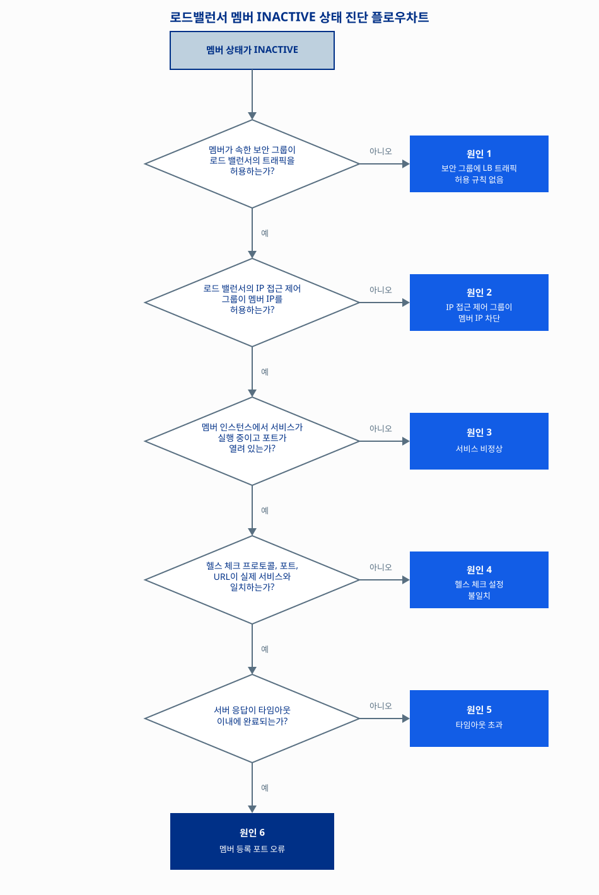

# Load Balancer 헬스 체크가 실패하고 멤버가 INACTIVE로 표시됩니다

## 증상

Load Balancer 콘솔에서 멤버 그룹의 멤버 상태를 확인하면, 등록한 멤버(Load Balancer가 트래픽을 분산하는 대상 인스턴스)가 `INACTIVE`로 표시되고 해당 멤버로 트래픽이 전달되지 않습니다.

다음과 같은 상황에서 나타납니다.

- 멤버를 Load Balancer에 새로 등록한 직후
- 인스턴스를 재시작하거나 애플리케이션을 새로 배포한 직후
- 정상 운영 중이던 멤버가 갑자기 `INACTIVE`로 전환된 경우

`INACTIVE` 상태가 지속되면 해당 멤버로는 트래픽이 전달되지 않아 나머지 `ACTIVE` 멤버에 부하가 집중됩니다. 멤버가 1개뿐인 구성이라면 서비스가 전면 중단될 수 있습니다.

> 이 문서에서 다루는 원인 중 일부(원인 1, 원인 2)는 헬스 체크뿐 아니라 Load Balancer를 거치는 일반 서비스 트래픽에도 동일하게 영향을 줄 수 있습니다. 즉 멤버가 `INACTIVE`로 표시되지 않더라도 유사한 연결 문제가 발생할 수 있습니다.

## 빠른 확인

멤버가 `INACTIVE`로 전환되는 사례의 상당수는 다음 두 가지 확인만으로 원인이 드러납니다. 5분 안에 확인할 수 있으니 먼저 시도합니다.

1. **멤버 인스턴스가 속한 보안 그룹 확인**: 멤버 인스턴스에 `default`가 아닌 별도로 생성한 보안 그룹이 적용되어 있다면, Load Balancer의 트래픽을 허용하는 규칙이 그 보안 그룹에 별도로 추가되어 있는지 확인합니다. `default` 보안 그룹을 그대로 쓰는 멤버는 Load Balancer와의 통신이 자동으로 허용되지만, 커스텀 보안 그룹을 쓰는 멤버는 규칙을 직접 추가해야 합니다.
2. **서비스 프로세스와 포트 상태 확인**: 멤버 인스턴스에 접속해 서비스 프로세스가 실행 중인지, 대상 포트가 열려 있는지 확인합니다.

   ```sh
   # 서비스 프로세스 상태 확인
   systemctl status <서비스명>

   # 포트가 열려 있는지 확인
   ss -tlnp | grep <포트번호>
   ```

두 항목 모두 정상이라면 다음 원인 진단으로 넘어갑니다.

> Load Balancer에 **IP 접근 제어 그룹**(Load Balancer로 유입되는 트래픽을 IP 단위로 허용하거나 차단하는 기능)을 별도로 설정한 경우에는, 원인 2도 함께 확인합니다. IP 접근 제어 그룹을 설정하지 않았다면(콘솔에 `-`로 표시됨) 이 원인은 해당하지 않습니다.

## 원인과 해결 방법

Load Balancer는 헬스 체크 기능으로 멤버의 상태를 주기적으로 점검합니다. 설정된 프로토콜과 포트로 멤버 인스턴스에 요청을 보내고, 지정한 시간(타임아웃) 안에 정상 응답 코드가 돌아오지 않으면 해당 멤버를 `INACTIVE`로 전환해 트래픽 대상에서 제외합니다. 원인은 이 점검 과정의 어느 단계에서 막혔는지에 따라 다음 여섯 가지로 나뉘며, 각 원인 아래에 해당하는 해결 방법을 함께 안내합니다.



### 원인 1: 멤버가 속한 보안 그룹이 Load Balancer의 트래픽을 허용하지 않음

Load Balancer는 생성 시 자동으로 `default` 보안 그룹에 할당됩니다. 멤버 인스턴스도 `default` 보안 그룹을 그대로 사용한다면 Load Balancer와의 통신이 별도 설정 없이 자동으로 허용되지만, 멤버 인스턴스에 `default`가 아닌 **별도로 생성한 보안 그룹**이 적용되어 있다면 그 보안 그룹에 Load Balancer의 트래픽을 허용하는 규칙이 없는 한 통신이 차단됩니다.

이 경우 헬스 체크 요청뿐 아니라, Load Balancer를 거쳐 멤버로 전달되는 **일반 서비스 트래픽도 동일하게 차단**됩니다.

**해결 방법: 보안 그룹에 Load Balancer 트래픽 허용 규칙 추가**

먼저 멤버 인스턴스에 적용된 보안 그룹이 `default`인지 확인합니다. `default`라면 별도 조치가 필요 없습니다. `default`가 아닌 커스텀 보안 그룹이라면, 아래 두 가지 방법 중 하나로 규칙을 추가합니다. **두 방법 모두 멤버 인스턴스가 속한 보안 그룹(커스텀 그룹) 화면에서 진행**합니다.

**방법 1: default 보안 그룹 전체를 허용 대상으로 등록**

1. NHN Cloud 콘솔에서 **Network > Security Groups**를 클릭합니다.
2. 멤버 인스턴스가 속한 보안 그룹을 선택합니다.
3. **+ 보안 규칙 생성**을 클릭합니다.
4. 다음과 같이 입력합니다.
   - 방향: **수신**
   - IP 프로토콜, 포트, Ether: 멤버에서 허용해야 하는 프로토콜과 포트를 선택
   - 원격: **보안 그룹** 선택 후 **default** 선택
5. **확인**을 클릭해 저장합니다.

**방법 2: Load Balancer IP만 개별로 허용**

1. NHN Cloud 콘솔에서 **Network > Security Groups**를 클릭합니다.
2. 멤버 인스턴스가 속한 보안 그룹을 선택합니다.
3. **+ 보안 규칙 생성**을 클릭합니다.
4. 다음과 같이 입력합니다.
   - 방향: **수신**
   - IP 프로토콜, 포트, Ether: 멤버에서 허용해야 하는 프로토콜과 포트를 선택
   - 원격: **CIDR** 선택 후 Load Balancer의 IP를 `/32`로 입력(예: `192.168.0.104/32`)
5. **확인**을 클릭해 저장합니다.

> **💡 알아두기**
> 보안 관점에서는 통신을 허용해야 하는 Load Balancer의 IP만 개별로 등록하는 **방법 2**가 더 안전합니다. 다만 연결해야 하는 Load Balancer가 여러 개이고 규칙을 여러 건 추가해 관리하기 번거롭다면, **방법 1**(default 보안 그룹 전체 허용)이 관리 측면에서 더 편리할 수 있습니다.
>
> 위 두 방법 모두 **수신(인바운드)** 규칙만 추가하면 충분합니다. NHN Cloud 보안 그룹은 stateful 방식으로 동작하므로, 수신 규칙에 따라 한 번 연결이 허용되면 그 응답(송신) 트래픽은 별도 규칙 없이도 자동으로 전달됩니다.

규칙을 추가한 뒤 Load Balancer 콘솔에서 멤버 상태가 `ACTIVE`로 바뀌는지 확인합니다.

### 원인 2: Load Balancer의 IP 접근 제어 그룹이 멤버 IP를 차단함

Load Balancer에는 유입되는 트래픽을 제어하는 **IP 접근 제어 그룹** 기능이 있습니다. 이 기능은 클라이언트에서 Load Balancer로 들어오는 트래픽뿐 아니라, **멤버가 Load Balancer로 보내는 응답 트래픽(헬스 체크 응답 포함)에도 동일하게 적용**됩니다.

IP 접근 제어 타입이 **차단**으로 설정되어 있고 그 차단 대역에 멤버 인스턴스의 IP가 포함되어 있다면, 멤버가 헬스 체크에 정상적으로 응답하더라도 그 응답 패킷이 Load Balancer 앞단에서 차단(Drop)되어 헬스 체크가 실패한 것으로 처리되고 멤버가 `INACTIVE`로 전환됩니다.

IP 접근 제어 타입이 **허용**인 경우에도 같은 문제가 발생할 수 있습니다. 허용 정책을 설정할 때 흔히 외부에서 접근하는 클라이언트의 IP 대역만 허용 목록에 등록하고, Load Balancer에 연결된 **멤버 인스턴스 자신의 IP는 빠뜨리는 경우**가 많습니다. 허용 목록에 없는 IP에서 오는 트래픽은 모두 차단되므로, 멤버의 헬스 체크 응답 역시 허용 목록에 없으면 차단되어 `INACTIVE`로 전환됩니다.

이 기능은 **명시적으로 설정한 경우에만** 영향을 줍니다. IP 접근 제어 그룹을 설정하지 않았다면(콘솔에서 IP 접근제어 타입이 `-`로 표시됨) 모든 트래픽이 허용되므로 이 원인에 해당하지 않습니다.

**해결 방법: IP 접근 제어 그룹에서 멤버 IP 허용**

1. NHN Cloud 콘솔에서 **Network > Load Balancer**를 클릭하고 대상 Load Balancer의 **상세 보기**를 선택합니다.
2. 상단의 **IP 접근 제어 그룹** 탭을 선택합니다.
3. 이 Load Balancer에 적용된 IP 접근 제어 그룹을 목록에서 **클릭**하여 상세 화면을 엽니다.
4. **IP 접근제어 대상** 탭에서 등록된 IP 목록을 확인합니다.
5. IP 접근제어 타입이 **차단**인 경우, 이 목록에 멤버 인스턴스의 IP가 포함되어 있는지 확인합니다.
   - 포함되어 있다면 해당 IP를 체크하고 **IP 접근제어 대상 삭제**를 클릭해 제거합니다.
6. IP 접근제어 타입이 **허용**인 경우, 이 목록에 멤버 인스턴스의 IP가 포함되어 있는지 확인합니다.
   - 포함되어 있지 않다면 **+ IP 접근제어 대상 추가**를 클릭해 멤버 IP를 추가합니다.
   - 허용 목록에 클라이언트의 IP 대역만 등록되어 있고 멤버 인스턴스의 IP는 빠져 있는 경우가 흔하니, 클라이언트 대역뿐 아니라 **멤버 인스턴스의 IP도 반드시 함께 등록**되어 있는지 확인합니다.

> **💡 알아두기**
> 목록 화면의 **IP 접근제어 그룹 변경** 버튼은 그룹의 이름·설명만 수정하는 기능이며, 실제 IP 목록은 수정하지 않습니다. IP 목록을 추가·삭제하려면 반드시 그룹을 **클릭해 상세 화면으로 들어간 뒤 IP 접근제어 대상 탭**에서 조작해야 합니다.
>
> IP 접근 제어 그룹은 **차단**과 **허용** 두 가지 타입으로 만들 수 있습니다.
> - **차단**: IP 접근제어 그룹에 설정된 IP의 접근을 차단하고, 그 외 모든 IP의 접근은 허용합니다.
> - **허용**: IP 접근제어 그룹에 설정된 IP의 접근을 허용하고, 그 외 모든 IP의 접근은 차단합니다.
>
> IP 접근 제어 그룹을 설정하지 않았다면(Load Balancer 상세 화면의 IP 접근제어 타입이 `-`로 표시됨) 모든 트래픽이 허용되므로 이 원인에는 해당하지 않습니다.
>
> **예외**: 타입이 **허용**인 그룹에서 IP 접근제어 대상(Rule)을 모두 제거하면, "사용 안 함"과 동일하게 모든 트래픽이 허용됩니다. 즉 허용 타입 그룹이 적용되어 있어도 대상 목록이 비어 있다면 이 원인에는 해당하지 않습니다.

설정을 변경한 뒤 Load Balancer 콘솔에서 멤버 상태가 `ACTIVE`로 바뀌는지 확인합니다.

### 원인 3: 멤버 인스턴스에서 서비스가 비정상

멤버 인스턴스에서 서비스 프로세스가 종료되어 있거나 대상 포트가 열려 있지 않은 경우입니다. 인스턴스 자체는 정상 작동 중이어도 서비스 프로세스가 종료되면 헬스 체크 요청에 응답할 수 없어 `INACTIVE`로 전환됩니다. 재시작이나 배포 직후 서비스가 완전히 시작되기 전에도 일시적으로 같은 증상이 나타날 수 있습니다.

**해결 방법: 서비스 재시작**

1. 멤버 인스턴스에 접속합니다.
2. 서비스 프로세스 상태를 확인합니다.

   ```sh
   systemctl status <서비스명>
   ```

3. 서비스가 종료되어 있다면 재시작합니다.

   ```sh
   systemctl restart <서비스명>
   ```

4. 재시작 후 포트가 정상적으로 열려 있는지 다시 확인합니다.

   ```sh
   ss -tlnp | grep <포트번호>
   ```

5. 서비스 로그를 확인해 종료된 원인을 찾고, 근본 원인을 수정합니다.

   ```sh
   journalctl -u <서비스명> -n 100
   ```

서비스가 정상적으로 재시작되면 Load Balancer가 다음 헬스 체크 주기에 멤버를 `ACTIVE`로 전환합니다. 전환까지는 헬스 체크 주기와 판정 횟수 설정에 따라 수십 초가 걸릴 수 있습니다.

### 원인 4: 헬스 체크 설정이 실제 서비스와 다름

Load Balancer에 설정한 헬스 체크의 프로토콜, 포트, URL 경로, 정상 응답 코드 중 하나라도 실제 서비스 엔드포인트와 일치하지 않는 경우입니다. 예를 들어 서비스는 `/health` 경로에서 `200 OK`를 반환하는데 헬스 체크 URL 경로가 `/`로 설정되어 있으면, 서비스가 정상이어도 헬스 체크는 계속 실패합니다.

**해결 방법: 헬스 체크 설정 수정**

1. NHN Cloud 콘솔에서 **Network > Load Balancer**를 클릭하고 대상 Load Balancer의 **상세 보기**를 선택합니다.
2. **멤버 그룹** 탭에서 헬스 체크를 확인할 멤버 그룹을 선택합니다.
3. **상태 확인** 탭을 선택합니다.
4. 다음 항목을 실제 서비스 엔드포인트와 하나씩 비교합니다.

   | 설정 항목 | 확인할 내용 |
   |---|---|
   | 상태 확인 프로토콜 | 서비스가 HTTP, HTTPS, TCP 중 무엇으로 응답하는지 |
   | 상태 확인 포트 | 서비스가 실제로 리스닝하는 포트와 같은지 |
   | URL | HTTP, HTTPS 프로토콜인 경우, 서비스가 응답하는 경로가 맞는지(예: /health) |
   | HTTP 상태 코드 | 서비스가 정상일 때 반환하는 코드와 같은지 |

5. 실제 서비스와 다른 항목을 올바른 값으로 수정하고 저장합니다.

> **💡 알아두기**
> 서비스 요청을 처리하는 경로를 그대로 헬스 체크에 사용하면, 요청 처리 로직에 있는 오류가 헬스 체크 결과에 그대로 반영될 수 있습니다. `/health`처럼 상태만 반환하는 전용 경로를 따로 두면 헬스 체크 결과가 서비스 상태를 더 정확하게 나타냅니다.
>
> HTTP 기반 헬스 체크가 원인을 특정하기 어려운 상태로 갑자기 실패하는 경우, 임시 조치로 상태 확인 프로토콜을 **TCP**로 전환하면 서비스를 우선 정상화할 수 있습니다. 이 경우 포트 연결 여부만 확인하므로 애플리케이션 레벨의 이상은 감지하지 못한다는 점에 유의하고, 근본 원인 파악 후 HTTP로 되돌리는 것을 권장합니다.

### 원인 5: 헬스 체크 타임아웃 안에 응답이 오지 않음

서버 응답 시간이 헬스 체크에 설정된 타임아웃보다 긴 경우입니다. 인스턴스 부하가 높아 응답이 지연되거나, 애플리케이션 초기화에 시간이 오래 걸릴 때 발생합니다. 서비스 자체는 정상이어도 응답이 타임아웃을 넘기면 헬스 체크는 실패로 판정합니다.

**해결 방법: 타임아웃 조정**

1. 멤버 인스턴스에서 서비스 응답 시간을 직접 측정합니다.

   ```sh
   curl -o /dev/null -s -w "응답 시간: %{time_total}초\n" http://localhost:<포트번호>/<경로>
   ```

2. 측정한 응답 시간이 상태 확인의 최대 응답 대기 시간 값보다 크다면 값을 늘립니다.
3. NHN Cloud 콘솔에서 **Network > Load Balancer**를 클릭하고 대상 Load Balancer의 **상세 보기**를 선택합니다. **멤버 그룹** 탭에서 해당 멤버 그룹을 선택한 뒤 **상태 확인** 탭에서 **최대 응답 대기 시간** 값을 늘리고 저장합니다.
4. 응답 시간이 계속 길다면 애플리케이션 자체의 성능 개선이 필요합니다. Cloud Monitoring에서 멤버 인스턴스의 CPU, 메모리 사용량을 확인해 리소스 병목이 있는지 점검합니다.

> **⚠️ 주의**
> 타임아웃을 지나치게 크게 설정하면 실제로 장애가 발생한 멤버를 늦게 감지합니다. 측정한 응답 시간의 2~3배 정도를 타임아웃으로 설정하는 것을 권장합니다.

### 원인 6: 멤버에 등록한 포트가 실제 서비스 포트와 다름

Load Balancer에 멤버를 등록할 때 지정한 포트 번호가 실제 서비스가 사용 중인 포트와 다른 경우입니다. 멤버 인스턴스와 서비스는 모두 정상이지만, 헬스 체크가 애초에 잘못된 포트를 확인하므로 항상 실패로 이어집니다.

**해결 방법: 멤버 삭제 후 재등록**

Load Balancer 콘솔에는 등록된 멤버의 포트 번호를 수정하는 기능이 없습니다. 멤버 그룹의 **멤버** 탭에는 추가, 삭제, 활성화, 비활성화 버튼만 제공되며 별도의 변경 기능은 없으므로, 잘못된 포트로 등록된 멤버를 삭제하고 올바른 포트로 다시 등록해야 합니다.

> **⚠️ 주의**
> 멤버를 삭제하는 동안 해당 멤버가 처리하던 트래픽은 나머지 멤버로 분산됩니다. 멤버가 1개뿐인 구성에서는 삭제와 재등록 사이에 서비스가 중단될 수 있습니다. 트래픽이 적은 시간대에 작업하거나, 재등록 전에 임시 멤버를 추가해 두세요.

1. NHN Cloud 콘솔에서 **Network > Load Balancer**를 클릭하고 대상 Load Balancer의 **상세 보기**를 선택합니다.
2. **멤버 그룹** 탭에서 잘못된 포트로 등록된 멤버가 속한 멤버 그룹을 선택합니다.
3. **멤버** 탭을 선택합니다.
4. 목록에서 잘못된 포트로 등록된 멤버를 체크하고 **멤버 삭제**를 클릭합니다.
5. **+ 멤버 추가**를 클릭해 실제 서비스 포트로 멤버를 다시 등록합니다.

재등록 후 멤버 상태가 `ACTIVE`로 바뀌는지 확인합니다.

## 문의하기

위 원인 1~6을 모두 확인했는데도 해결되지 않는다면, 보안 그룹·IP 접근 제어 그룹·서비스 상태·헬스 체크 설정이 모두 정상인데도 `INACTIVE`가 지속되는 드문 경우일 수 있습니다. 이런 경우 사용자 측 설정 문제가 아니라 플랫폼 측 이슈일 가능성이 있으므로, 추가로 원인을 찾기보다 NHN Cloud 고객지원에 바로 문의하는 것이 빠를 수 있습니다. 문의 시 다음 정보를 함께 전달하면 진단 시간을 줄일 수 있습니다.

- 문제가 발생한 Load Balancer 이름 및 ID
- `INACTIVE` 상태인 멤버 인스턴스 이름
- 증상이 처음 나타난 시각(한국 표준시 기준)
- 현재 설정된 상태 확인 값(상태 확인 프로토콜, 상태 확인 포트, URL, HTTP 상태 코드, 최대 응답 대기 시간)
- 멤버 인스턴스에 적용된 보안 그룹 이름 및 수신 규칙 목록
- Load Balancer에 적용된 IP 접근 제어 그룹 이름 및 타입(차단/허용), 규칙 목록
- 지금까지 시도한 조치 내용

## 문제 예방하기

- **헬스 체크 전용 경로 운영**: 서비스 요청 처리 경로와 분리된 헬스 체크 전용 경로(예: `/health`)를 두고, 서비스 상태에 따라 정상일 때는 `200 OK`, 비정상일 때는 `503 Service Unavailable`을 반환하도록 구성합니다. 헬스 체크 결과가 실제 서비스 상태를 더 정확하게 반영합니다.
- **멤버 등록 전 사전 점검**: Load Balancer에 멤버를 등록하기 전에, 멤버 인스턴스에 적용된 보안 그룹이 `default`가 아니라면 Load Balancer 트래픽을 허용하는 규칙이 미리 추가되어 있는지 확인합니다. 또한 Load Balancer에 IP 접근 제어 그룹이 설정되어 있다면, 차단 타입인 경우 새로 등록할 멤버의 IP가 차단 대상에 포함되어 있지 않은지, 허용 타입인 경우 클라이언트 IP 대역뿐 아니라 멤버 인스턴스의 IP도 허용 목록에 포함되어 있는지 함께 확인합니다.
- **리소스 사용률 경보 설정**: Cloud Monitoring에서 멤버 인스턴스의 CPU, 메모리 사용률이 임계값을 넘으면 경보를 받도록 설정합니다. 리소스 병목을 미리 발견하면 응답 지연으로 인한 헬스 체크 실패를 줄일 수 있습니다.

